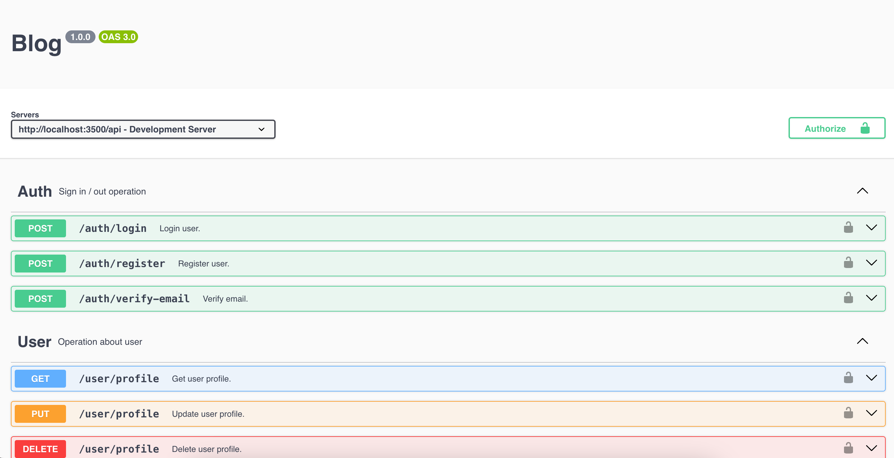

# Blog REST api

## Table of contents

- [Overview](#overview)
  - [API](https://blog-api-git-master-lointainy.vercel.app/)
- [My process](#my-process)
  - [Built with](#built-with)
- [Author](#author)

## Overview

## My process

###### Built with

- [Vite](https://vitejs.dev/) - module bundler
- [Node](https://nodejs.org/en/docs/) - library
- [express](https://expressjs.com/) - framework for nodeJs
- [MongoDB](https://www.mongodb.com/docs/manual/) - database
- [Prisma](https://www.prisma.io/docs/getting-started) - ORM
- [ZOD](https://zod.dev/) - data validation
- [Swagger](https://swagger.io/) - documentation for API

###### Author

